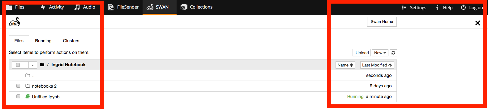
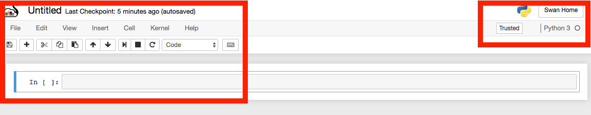
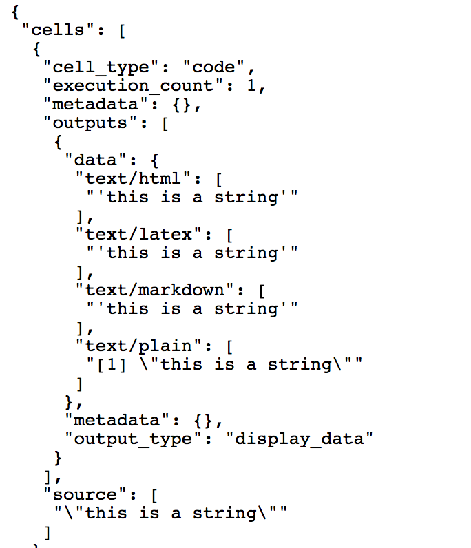
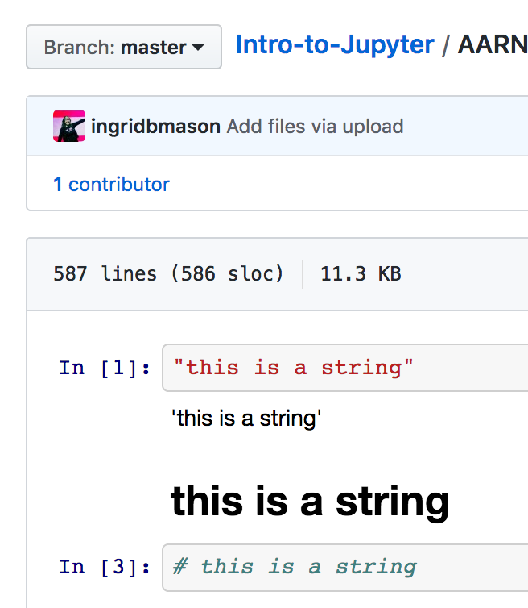
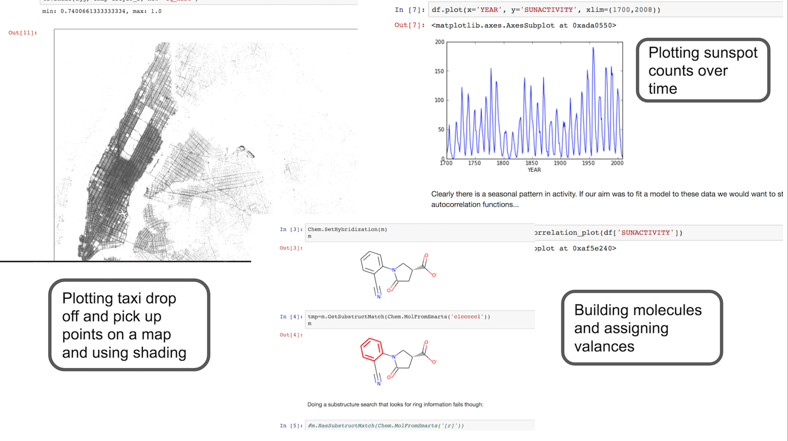
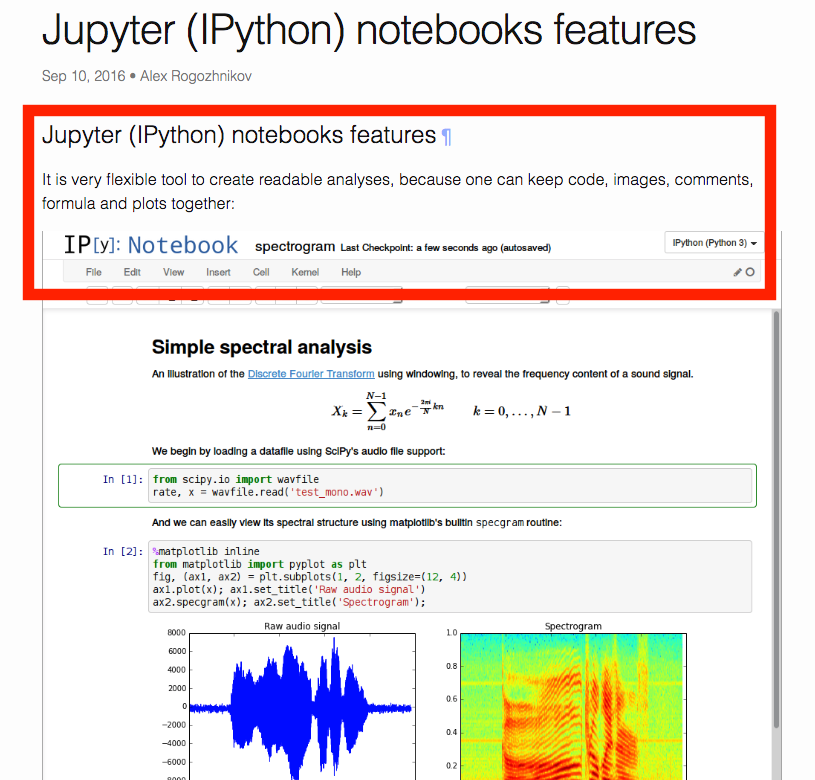

@title[Introduction]
### Intro to Jupyter Notebooks

For Research Support Specialists

C3DIS 2019
 

Note: 

A first look at notebooks, why they are useful and how to use them. Then some time working with a notebook.     

---
@title[Agenda]
### Agenda 
- What is a Jupyter notebook and how does it function. *30 mins*
- Where does a Jupyter notebook fit in different researcher toolkits. *45 mins*
- Why use Jupyter notebook on a desktop and why use it in the cloud. *30 mins*
- Basic Python programming using a Jupyter notebook. *30 mins*
- Wrap up. *10 mins*

Note:  

If we have time, we can have a go at using R too, with some basic commands.  

---
@title[Notebook Function]
### Notebook Function 

- Notebooks may be useful for researchers! 
- Notebooks could accelerate research or just improve a few processes to make life less tedious. :)

Note:

- Objective: Understand what notebooks are capable of. 
- Activity: How could you see a notebook being useful to researchers?
- Check out a [Jupyter notebook gallery](https://github.com/jupyter/jupyter/wiki/A-gallery-of-interesting-Jupyter-Notebooks), [Programming Historian](https://programminghistorian.org/) or the [DH Lab at EPFL](https://github.com/dhlab-epfl?language=jupyter+notebook). 

---
@title[Notebook Description]
### Overview

Jupyter Notebooks offer a hybrid environment in which you can perform computational tasks while also using text to annotate or describe what you and your code blocks are doing. It is like a mix between working in a command line interface, writing arguments in a programming language, and working in a word processor application, writing up documentation.
 

---
@title[Notebook Overview]
### What can Jupyter Notebooks do?

“The Jupyter Notebook is an open-source web application that allows you to create and share documents that contain live code, equations, visualisations and explanatory text. Uses include: data cleaning and transformation, numerical simulation, statistical modelling, machine learning and much more.”

–description from [Project Jupyter](https://jupyter.org/)

---
@title[Data Cleaning]
#### Data cleaning

Data cleaning is about finding and correcting (or removing) inaccuracies from a dataset, a table, or a database. The process involves identifying incomplete, incorrect, inaccurate or irrelevant parts of the data and then replacing, modifying, or deleting them.

Note:

In Jupyter Notebooks you can preview and analyse a limited number of columns and rows of data at a time, so you can see if there are blanks or repeated errors or inaccuracies. In addition, working directly with a large dataset without having to download it can save a lot of time.

---
@title[Data Transformation]
#### Data transformation

Data transformation is the process of converting data values from one source format or structure to another so they become consistent or intelligbible to a target structure or system. A typical scenario where information needs to be shared involves the extraction of the data from the source application or data custodian, the transformation of that data into another format, and finally loading the transformed data into the target location.

---
@title[Numerical Simulation]
#### Numerical Simulation
Simulation can be used to trace waves e.g. seismic or shock waves.   

---
@title[Statistical Modelling]
#### Statistical Modelling
Linear regression: is a type of statistical model used to reveal a relationship between two variables.

---
@title[Data Visualisation]
#### Data Visualisation
Network analysis: is a form of data visualisation of nodes of different sizes connected in a network.  

---
@title[Programming Languages]
### Programming Languages

Jupyter Notebooks can be used with a variety of different programming languages. Initially the notebookes were for *Julia*, *Python* and *R* but now they support many more languages. 

If you don't know the languages and packages researchers use, it might be helpful to think about the types of tasks they want to perform. Python is currently the most popular language used in Jupyter Notebooks as well as R, you can also consider what is commonly used in different fields of research.

Note:

- Objective: Understand languages (and packages) that are suited to different research tasks. 
- Activity: In pairs, talk about which programming language might make the most sense for you and why. When you are ready, think about how you would recommend Python or R to someone else in your field. Share this with the group.

---
@title[Technical Overview]
## Technical Overview

You don't need anything special to run a notebook - just a browser will do!

Jupyter Notebooks don't need much to get going. They are editable and viewable in a web browser. You can also run them on a local machine with no internet or a remote machine with internet. They are very flexible and free!

Note: 

- Objective: Understand how notebooks run and how they are different to the command line
- Activity: Look at an example on GitHub

---
@title[Technical Breakdown]
### Technical Breakdown

- Used to capture documentation and executable code 
- An editable document with input and output “cells” (text strings) 
- Document files e.g. *yourfilename.ipynb*

Note:   

Human-readable documents containing: analysis description and the results (figures, tables, etc..) and executable documents which can be run to perform data analysis. 

---
@title[Notebook Operation]
### Notebook Operation

- Editable and viewable in a web browser
- Can run on local machine with no internet
- Can run on remote machine with internet

---
@title[Notebook File System]
### Notebook File System

---
@title[Notbook UI]
### Notebook UI

---
@title[Notebook Kernels]
### Notebook Kernels

- Notebooks use a “kernel”, which is kind of like an interpreter. This is what turns a programming language into instructions the computer understands so it can do the work. 
- Different kernels can be installed for different types and versions of programming languages. The kernel in the notebook is a program that runs code written in a specific programming language.

Note: 

- In regular computers a kernel connects the application software to the computer hardware. In the case of Jupyter Notebooks, this application permits displaying, editing and running program commands via a web browser.
- Notebooks use blocks of code to perform computational processes resulting in outputs, or results.

---
@title[Cells]
#### Cells

Jupyter notebooks are a series of “cells” containing *executable code*, *outputs*, or *markdown*.
 
Cells might contain code executed (through the kernel) or markdown formatted text (including [LaTeX](https://www.latex-project.org/)) to embed the description of the work process next to the code.

---
@title[Code]
#### Code

- Code: "Running code" means making the computer do what you are telling it to do. "Executing code" is the same thing.
- Output: In Jupyter Notebooks "output" is the result of the computational process, such as a visualisation, graph, model, equation and so on

---
@title[Markdown]
#### Markdown

Markdown is formatted text you want to include such as headings, italics, quotes and other types of styling. It might be a description, a note, a question (as context).

-see the overview from the [Markdown Guide](https://www.markdownguide.org/basic-syntax/) 

---
@title[Command Line]
#### Compared to Command Line

Command line does not include notes. In Jupyter Notebooks you can also go back and delete or change code or text as you go, which you cannot do using the command line.

Note:

---
@title[Inline Presentation]
#### Inline Presentation

Notebooks present markdown and visualisations inline - meaning you can see the both at the same time and the parts that aren't code do not interfere with the code. It results in a highly flexibly but user-friendly environment that can perform complicated tasks very quickly.

---
@title[JSON View]
#### JSON View

Jupyter Notebooks are saved as a JSON (JavaScript Object Notation) file with ".ipynb" as the file extension e.g. yourfilename.ipynb
 

---
@title[Notebook View]
#### Notebook View

Jupyter Notebooks are viewed as file with cells, containing code, outputs or markdown.

---
@title[Notebook Gallery]
#### Notebook Gallery
- Plotting taxi drop off and pick up points on a map and using shading
- Plotting sunspot counts over time
- Building molecules and assigning valances

Note: 

Jupyter Notebooks are used in a wide range of research areas
- http://nbviewer.jupyter.org/gist/jhemann/4569783
- http://nbviewer.jupyter.org/gist/greglandrum/4316433 
- https://anaconda.org/jbednar/nyc_taxi/notebook 

---
@title[Notebook Availability]
#### Notebook Availability

- Notebooks are widely available, offline using Anaconda, and online CloudStor SWAN, Jupyter.org, MyBinder, Google Colaboratory, AWS.  
- Opportunities and challenges: portability, shareability, data colocation, research data management.     

---
@title[Summary]
#### Summary

A notebook:
- Runs on your desktop with no internet or on a remote server via the internet 
- Requires a kernel (computational engine) to execute code e.g. Python or R
- Runs and stores the code and output, with markdown notes
- Is an editable document with input and output cells 
---
@title[Postscript]
#### Postscript

A notebook is a terrific way of keeping a record of research, research data processing and techniques, that enables research to be repeated, duplicated, tested, and shared.  

---
@title[Researchers' Toolkit]
## Researchers' Toolkit 

2017 survey of data scientists, top three data science/analytics tools, technologies and languages used in the past year:

- Python 60%
- R 46%
- Jupyter notebooks 32%

Note: 

The survey included a question for data professionals who were employed, “For work, which data science/analytics tools, technologies, and languages have you used in the past year? (Select all that apply).”  

[2017 Survey](http://businessoverbroadway.com/2018/01/02/most-used-data-science-tools-and-technologies-in-2017-and-what-to-expect-for-2018/)

---
@title[Researchers' Notebooks]
### Researchers' Notebooks

- Designed to make data analysis easier to share and reuse
- Used increasingly by researchers who want to keep detailed records of their work

Note:

University of Texas at Austin, Tal Yarkoni uses the [notebook](http://arogozhnikov.github.io/2016/09/10/jupyter-features.html) to run automated meta-analyses of brain imaging studies to uncover patterns of neural activity involved in language processing, emotion and other processes.

---
@title[Research Use]
### Research Use

- Research questions don’t marry with functions in commercial tools  
- Automating analyses to speed up data crunching 
- Protect datasets from deletion or changes
- Reworking analyses is quick 
- Working with datasets too big for commercial tools

Note:

- Researchers can't look through 10,000s of data points anymore in e.g. spreadsheets, to analyse that data researchers are beginning to write custom code (using different programming languages) that works with more data and fit with their particular investigations and experiments. R is often for statistics or Python for repetitive tasks and for extracting data from web-based applications. 

---
@title[Research Use]
### Research Use

---

---
@title[Using Notebooks]
### Using Notebooks

- Devise teaching modules and collaborate with colleagues 
- Researchers are publishing the notebooks to back up their research papers
- Using jupyter notebooks as a new form of interactive research publishing

-check out the [GLAM Workbench](https://github.com/GLAM-Workbench) and [Digital History Workshop](https://slides.com/wragge/digital-history-workshop-anu-2019#/) by Dr Tim Sherratt 

Note:

GLAM Workbench "Jupyter notebooks for working with cultural heritage collections from Australia and New Zealand"

---
@title[Example Notebook]
#### Example Notebook

OZ GLAM Workbench is 
- [stored in GitHub](https://github.com/GLAM-Workbench/ozglam-workbench) 
- [viewable through Jupyter viewer](https://nbviewer.jupyter.org/github/wragge/ozglam-workbench/blob/master/1-Introduction-and-table-of-contents.ipynb)
- [rendered by MyBinder](https://mybinder.org/v2/gh/wragge/ozglam-workbench/master) or other services

---
@title[Notebook Use]
#### Notebook Use

- Learn how to code and experiment with data processing
- Interactive, provides immediate feedback
- Work in code blocks (not whole scripts)  

Note:

- Learn from others’ efforts and understand their data and research processes    
- Test out calculations and visualisations that highlight important data points
- Great for exploration data analysis, presenting results, sharing ideas 
- Flexibility to test out ideas matched with jumping between cells in the notebook 
- Works with version control software e.g. GitHub 
- Shareable with those that don’t have the notebook installed e.g. GitHub or Nbviewer
- Permits a quick set of steps: document and run code then look at code outcome e.g. equations or visualisations
- Use for: testing a specific block of code, not the whole script 
- More interactive: code display aids learning, interpretation, collaboration, understanding 
- Instant feedback and ability to share easily 
- Graphical rendering markdown and plots inline 

---
@title[Notebook Gotchas]
#### Notebook Gotchas

- “Working state” can be altered and make it difficult to reproduce results 
- Not great for production code development 
- Not intended as an IDE (integrated development environments) 

Note: 
- Dr Steve Cassidy "The main advantage is to preserve context of computed results but in fact that turns out to be a bad idea since the notebook model encourages out-of-order execution – the longer your notebook is running the more likely it is that variable values don’t correspond to the current code.   I prefer to re-start notebooks and re-run to ensure that what I’m seeing corresponds to what has run." Email exchange with Ingrid Mason (AARNet) 11 December 2018. 
- For more information [The Future of Notebooks: Lessons from JupyterCon](https://news.ycombinator.com/item?id=17839188) and check out the [WYSIWYG alternative model e.g. Observable](https://news.ycombinator.com/item?id=17839188).  

---
@title[Why Not Use Jupyter?]
### Why Not Use Jupyter

- Other applications already help a researcher do what they need to
- No use for markdown or coding in the work a researcher does 
- Work with small datasets that are easy to load into applications 
- Not able to or keen on installing new software on a machine?*

Note:

- The asterisk was a trick point, Jupyter operates in cloud services, but there are packages that may need to be loaded that are not available in different providers' services.  

---
@title[Why Not Use Jupyter?]
### Why Not Use Jupyter 

- Yet to see a notebook that they would like to copy and learn from 
- Cell executing and ordering, and hidden state (easy to mess up)  
- Saving and checkpointing (confusing) 

Note:

- Look through Joel Grus' slidedeck [I don't like notebooks](https://docs.google.com/presentation/d/1n2RlMdmv1p25Xy5thJUhkKGvjtV-dkAIsUXP-AL4ffI/edit) given at JupyterCon 2018.   
- Checkpoint (the notebook and the hidden checkpoint file .ipynb_checkpoints) to recover work. 

---
@title[Service Comparisons]
#### Service Comparisons

- languages supported and ability to install packages
- interface and keyboard shortcuts (similarity to Jupyter)
- missing or different features and version control

Note:

- Check out this [comparison](https://docs.google.com/spreadsheets/d/12thaaXg1Idr3iWST8QyASNDs08sjdPd6m9mbCGtHFn0/edit#gid=1505836451) of Binder, Kaggle Kernels, Google Colaboratory, Microsoft Azure Notebooks, CoCalc, Datalore by Kevin Markham (Data School). 
- Worth reading Markham's post on ["How to choose the right service for you"](https://www.dataschool.io/cloud-services-for-jupyter-notebook/#howtochoosetherightserviceforyou). 

---
@title[Desktop v Cloud]
#### Desktop v Cloud

- Desktop: able to load software, no internet required, datasets small to load in 
- Cloud: explore and extract data from large datasets without having to download them

---
@title[Hands On]
## Hands On

- Look at an example of a Jupyter Notebook [in GitHub](https://github.com/ingridbmason/Intro-to-Jupyter/blob/master/AARNet_Intro_Jupyter.ipynb)
- Identify the cells, what is input and what is output, and what is markdown. Discuss the types of output. 
- Examine the code. Different colours are used. Have you seen that before? Why do you think different colours are used?

Note: 

If you have seen or used the command line before, can you think of any reasons why Notebooks might be easier to use? Discuss your ideas and experiences with the group. If you haven't used the command line before, have a think about why notebooks could be less daunting for beginners.

---

